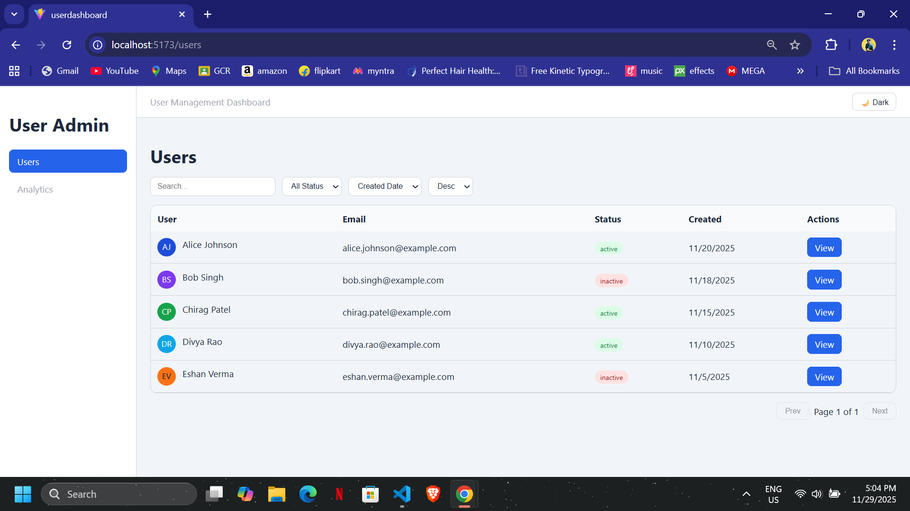
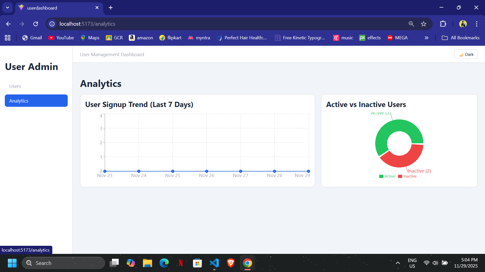

# ⭐ User Management Dashboard (React + Vite + Redux Toolkit)

This project showcases real-world frontend engineering skills using:

- **React (Vite)**
- **Redux Toolkit**
- **Styled Components (Dark/Light Theme)**
- **Recharts (Analytics Charts)**
- **Debounced Search**
- **Skeleton Loaders**
- **Reusable UI Components**

This dashboard includes a full user listing, user details page, analytics charts, filters, sorting, pagination, and a polished UI.

---

## 📸 Screenshots

> Add actual screenshots after deploying

| Users (Light Mode) | Users (Dark Mode) | Analytics (Light Mode) |Analytics (Dark Mode)|
|-----------|--------------|-----------|-----------------|
|  |  |  | |

---

## 📦 Tech Stack

- **React + Vite**
- **Redux Toolkit**
- **Styled Components (theme provider with CSS variables)**
- **Recharts** for analytics
- **React Router DOM**
- **Custom Hooks** (useDebounce)
- **JavaScript (ES2023)**

---

# 🎯 Features

### ✅ Users List Page
- Search Users (Debounced, Smooth)
- Filter by Status
- Sort by Name / Created Date
- Pagination
- View User Details
- Reusable Table Component
- Seamless Dark/Light Mode

### ✅ User Details Page
- Profile card
- User activity summary
- Last 5 actions
- Edit user (modal)
- Fully responsive layout

### ✅ Analytics Page
- Signup trend (last 7 days) using Line Chart
- Active vs inactive users (Pie Chart)
- Enhanced charts with:
  - Gradients
  - Animations
  - Theme-aware tooltips
  - Legend

### ⭐ Bonus 
- **Debounced Search**
- **Skeleton Loaders**
- **Dark/Light Mode**
- **Reusable UI components (Button, Input, Badge, Card, Table, Select)**
- **Enhanced charts with gradients + animations**

---

# 📁 Folder Structure
```lua
src/
├── app/
│ └── store.js
│
├── theme/
│ ├── dark.js
│ └── light.js
│
├── features/
│ ├── users/
│ │ ├── usersSlice.js
│ │ └── usersSelectors.js
│ ├── filters/
│ │ └── filtersSlice.js
│ └── theme/
│ └── themeSlice.js
│
├── components/
│ ├── ui/
│ │ ├── Button.jsx
│ │ ├── Input.jsx
│ │ ├── Select.jsx
│ │ ├── Card.jsx
│ │ ├── Badge.jsx
│ │ └── Table.jsx
│ ├── skeleton/
│ │ ├── Skeleton.jsx
│ │ ├── UsersTableSkeleton.jsx
│ │ ├── UserDetailsSkeleton.jsx
│ │ └── AnalyticsSkeleton.jsx
│ └── layout/
│ ├── AppLayout.jsx
│ ├── Sidebar.jsx
│ └── Topbar.jsx
│
├── pages/
│ ├── UsersList.jsx
│ ├── UserDetails.jsx
│ └── Analytics.jsx
│
├── hooks/
│ └── useDebounce.js
│
├── data/
│ └── users.js
│
├── App.jsx
├── main.jsx
└── index.css
```

---

# 🛠️ Installation & Setup

## 1️⃣ Clone the repository

```bash
git clone https://github.com/<your-username>/<repo-name>.git
cd <repo-name>
```
## 2️⃣ Install dependencies

```bash
npm install
```
## 3️⃣ Start development server

```bash
npm run dev
```
## Now open:

```bash
http://localhost:5173
```
## 🔧 Build for Production

```bash
npm run build
```
# 🧪 Future Enhancements (Optional Ideas)

- Replace mock API with backend (Node/Express)
- Add authentication
- Role-based access
- Export table data (CSV/PDF)
- React Query for fetching users
- Unit tests with Vitest
